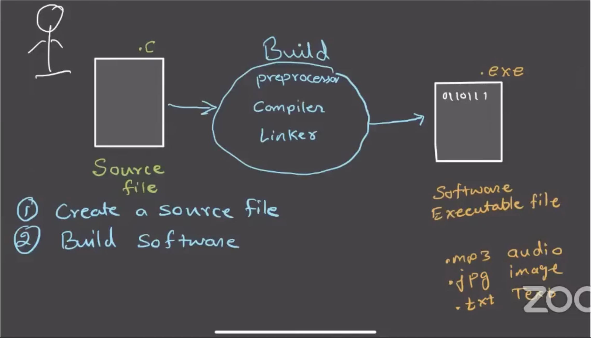
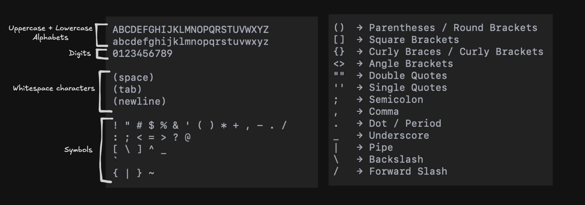
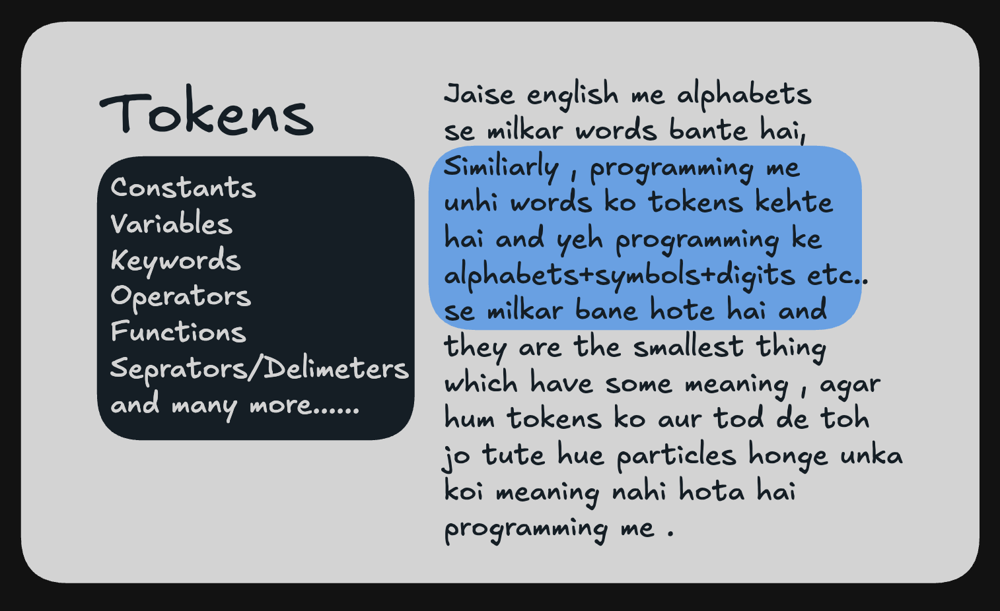
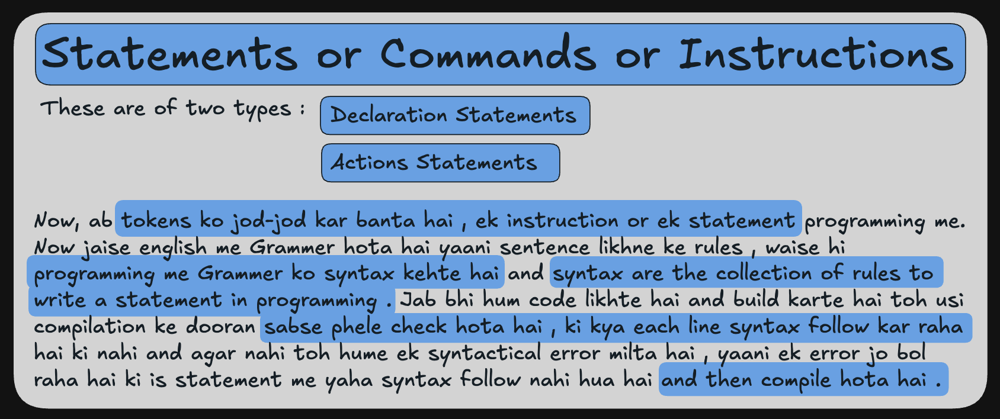
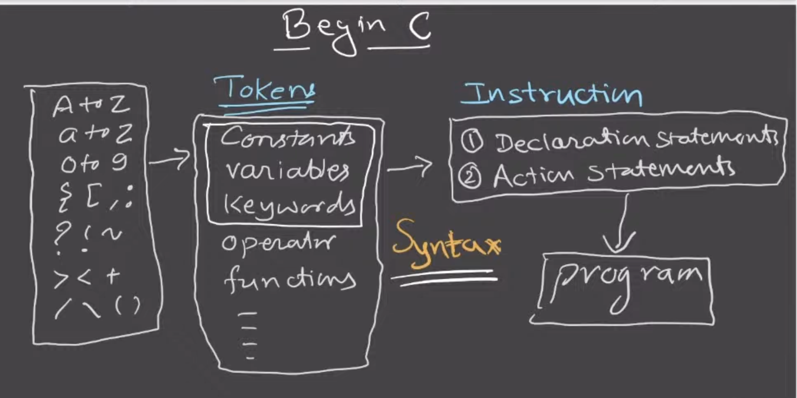
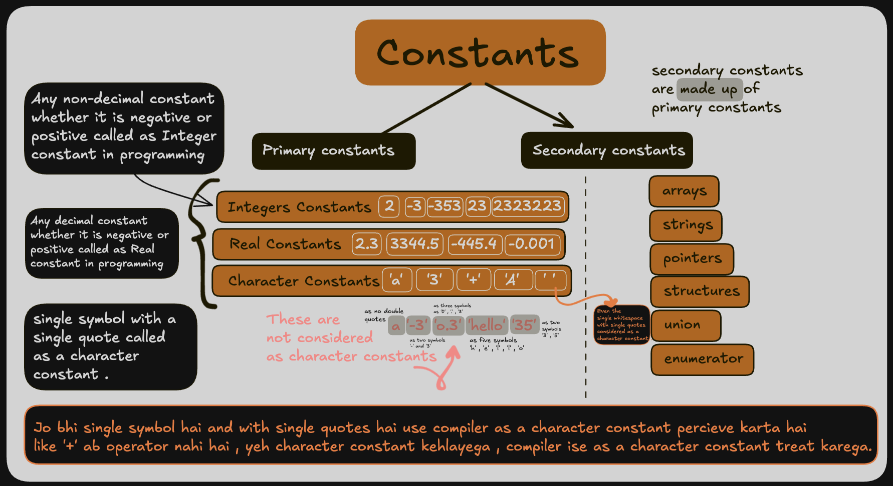
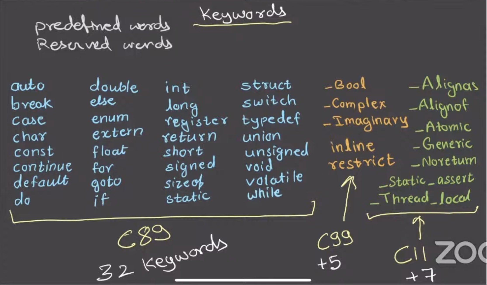

<What to understand more ->
RAM AND HOW IT WORKS WITH MACHINE AND PROGRAM RUNNING ?
.exe for Windows and .apk for android then what for Linux and MacOs

---------------------------------------------------------------------------------------------------------
How a computer works , what is programming and what is a program ?
To understand this , hum ek example lete hai .

Let say ek person hai Person A , now Person A jo hai wo ek insurance agent hai jo ki ghar-ghar jaakar info insurance bhechta hai , now ab jab wo kisi ghar par jaata hai toh use pehle user ki information collect karni parti hai and then calculate karke , calculation ke hissab se wo premium(insurance) sell karta hai ,but yeh calculation ka kaam us Person A(insurance seller) ko bahut boring lagta hai , toh wo is baat ko apne ek dost ko batata hai ,toh uska dost usko suggest karta hai ki tu ek computer le le , Person A bazaar jaakar ek computer le aata hai , now ab Person A toh khush ki ab yeh computer mere liye calculation kar dega , fast bhi hoga and error bhi nahi hoga , but ab problem yeh hai ki is computer ko toh premium calculate karna aata hi nahi hai ,ab Person A bhaga-bhaga jaata hai apne usi dost ke paas jisne use computer lene ka suggestion diya tha and usse puchta hai ki yeh computer toh bekaar hai yeh calculation kar hi nahi raha hai , toh uska dost bolta hai usse ki maine yeh nahi bola tha ki yeh har type ki calcution kar dega , maine toh yeh bola tha ki computer ek aisi cheez hai jisme ek potential hai ki wo har tarah ka calculation kar sakta hai yaani agar tum isko sikha do ki koi calculation kaise karni hai toh yeh seekh jaayega and then yeh wo calculation karna start kar dega , yaani ek computer kisi bhi type ki calculation seekh sakta hai and seekhkar use kar sakta hai , yaani computer koi bhi task kar sakta hai but hume use pehle sikhana padta hai step by step ki wo task karna kaise hai .Now ab Person A ko yeh samajh aa jata hai ki computer ko sikhna padega toh wo Person A us computer ko English , Hindi etc. language me sikhane ki koshish karta hai but computer ko kuch bhi smajh nahi aata hai kyuki computer toh sirf binary language hi samajhta hai (0 and 1 me likhi hui language), toh Person A ka dost bolta hai ki tum is computer ko ek programmer ke paas lekar jaao usi ko binary language aati hai , wo is computer ko samajha dega ki premium kaise calculate karna hai , now Person A bhaga-bhaga jaata hai ek programmer ke paas and use programmer ko bolta hai ki is computer ko sikha do ki premium kaise calculate karte hai , toh programmer Person A se kehta hai , accha thik hai mai tumhara yeh kaam kar dunga , but pehle mujhe toh samajhao ki english yaa hindi me ki premium kaise calculate karte hai , toh Person A us programmer ko premium calculate karne ka logic samajha deta hai and then uske basis par wo programmer ek binary file banata hai (yaani binary code me wo logic explain karta hai computer ko samajhane ke liye ki kya input me lena hai, kaise kya logic lagana hai and then kya output dena hai) and us file(software) jo ki for Windows is in this format like (filename.exe),for Mac and Linux no extension and , for android (.apk)  ko Person A ko de deta hai and person A us file (yaani software as each binary file is called as software) ko lekar jaata hai and apne computer me run karta hai and ab computer premium calculate karna start kar deta hai , now ab jab bhi Person A ko koi kisi customer ke liye premium calculate karna hota hai , toh wo apne computer par us software ko open(run) karta hai and usme input daalta hai and computer ne kyuki ab premium kaise calculate karte hai wo seekh liya hai, toh wo calculate karke us Person A ko as output de deta hai , ab yeh kaam bhi fast ho jaata hai and error bhi nahi hota hai , 100% accurate results .This is how a computer works .
// In total agar hum chahte hai ki hamara computer koi task perform kare yaani koi calculation kare toh hume use wo calculation yaa task karna sikhana padta hai and sikhane ke liye hum ek software likhkar computer me run karte hai jisse computer wo task karna sikhta hai and then perform karta hai yaa karne deta hai like calculator is a software , jispar hum calculation kar sakte hai,photoshop is a software jispar hum photo editing kar sakte hai yaani pehle jab humne wo software run(open) kiya us computer par toh file execute hui and computer ne samajha ki user ne jab brush liya toh wo kya kar sakta hai and jab eraser liya toh wo kya kar sakta hai and then when user ne brush liya with red color and screen par mouse ghumaya toh screen ke pixels red hone lage yaani file me likha tha ki jaha-jaha yeh brush with red color ghume wo pixels red kar dena  . Toh yaani ek program(program hota hai yaani set of instructions likhna which tells the computer what to do) ko create karna, likhna hi programming hota hai .

🟦 One more Important point
🟡Jaruri nahi hai ki ek badi si screen wala device hi ek computer ho , what are the needs such that we can say something a computer ? 🟡

🟦 One Important point
Ki kya user aaj bhi binary me code karta hai , binary me code karne ki toh bahut limitations hai , Pehli baat toh sab kuch 0 and 1 me likhna hai toh thoda se kaam ke liye bahut jyada-jyada code likhna pad jaayega, 0 and 1 se toh pages bhar jaayenge and 2nd point is ki agar galti se kahi bhi ek jagah 0 ki jagah 1 or vice-versa galti se ho gaya tab toh pura code ka meaning hi change ho jaayega very risky and 3rd is that 🟡 binary code is hardware dependent 🟡 .
Toh iska answer aaya ki ek programming language jo ki kind of english ki tarah hogi easy to understand but not completely english that's where the low level languages like C and C++ and other languages are born .

Now, the work for the programmer is simple .
Ab programer ko ek software banane ke liye , bus ek file me C language yaa C++ or any other language me code likhna hai(that file is called as source file and that code is called as source code) and then us source file ko Build karna hai , Build karne ka matlab hota hai translating(is translation yaani build ke liye machine ko three programs yaani softwares ki need hoti hai (pre-processor + compiler + linker),jab yeh teeno ek sequence me run hote hai toh hi ek C yaa C++ ka code build hota hai yaani translate hota hai and in teeno me se bhi compiler is most important C ka compiler hai gcc and c++ ka g++ , ese market me aur bhi compiler hai c and c++ ke but these gcc and g++ are the best ones also yeh joh three programs hai yeh toh hamesha pure binary code me hi likhe hote hai , kyuki agar inko humne c yaa c++ me likh diya toh inhe binary me kon compile yaani build yaani translate karega . ) that programming language into a Computer Understandable Code which is Binary code , build karne se source file se ek binary file banti hai , jo ki ek software hota hai and ise run karne par , computer same like how previously it understands , similiary this time also wo seekh jaata hai ki calculation yaa koi task kaise karna hai .That's how a programming language becomes more useful and convenient .

🟦 One more Important point
What is a IDE ?
IDE is a software jo ki ek programmer ko kisi program ko develop karne ke liye jo-jo chahiye hota hai use provide karta hai ek hi screen par that is we called as a IDE(Integrated Development Environment) . Every IDE provides atleast minimum of these 3 things : 
1.code editor
2.debugging tools
3.build tools 

1. Hum yeh binary file ya source code file ko kahi bhi likh sakte hai , even in a simple text-editor(notepad) .Code kaha likh rahe hai wo important nahi hai , code ko build karna and run karna in a machine is important .Ab code toh ham ek text editor me bhi likh sakte hai , but kyuki ek text editor ko pata nahi hota hai ki hum kya yaani konsi language likh rahe hai toh wo ek programmer ki kisi bhi type se help nahi kar paata hai ,Toh uske liye we have code editor , code editor is  same like a text editor but it knows ki hum kya likh rahe hai like we are writing a C program toh wo uske hissab se cheezo ko highlight karna and jitne tareeko se wo us kaam ko easy dikha sake , aasaan kar sake, wo karne ki koshish karta hai ek programmer ke liye .

2. Jab hum koi code likhte hai toh uski testing bhi required hoti hai , toh wo testing ke liye jo set of programs IDE me hote hai uski collection ko ki hum debugging tools kehte hai .

3. Build tools wo set of programs like pre-processor + compiler + linker called as build tools jo ki ek IDE hume deta hai such that we can build our code means translate to binary or compiles to binary .

//Remember VS code is not a IDE , its only a code editor but we can make it as a IDE by using extensions that they provide or like we can build or configure it as a IDE through several files and extensions .Software ko run karne ke liye hume vs code ki need nahi hai , hume software ko develop karne ke liye hi VS code ki need hai yaani code edit , write , debug , and running build tools. Jo ki us likhe gaye code ko build karke ek executable file .exe or .apk yaani software(that binary file) dete hai and then ab us file ko supported OS par run kar lo like .exe runs on Windows and .apk on android etc.. , uske liye don't need of VS code . {“Jab hum binary file ko open karte hain, operating system usse load karta hai aur CPU us binary instructions ko execute karta hai. Iske baad software apna interface ya output screen par dikhata hai.”}.

---------------------------------------------------------------------------------------------------------

History of C language ?
Toh pehle purane time me hamare paas Yeh C and C++ etc. languages nahi hoti thi . Toh us time par hamare paas hota tha BPCL(Basic Combined Programming Language) jise ki Martin Richards ne 1966 me banaya tha .Now kya hota hai ki ek organization thi us time par AT&T's Bell Labs karke jo ki ek Research Lab thi on Computer and Programing . Toh kya hota hai ki ek baar AT&T's + MIT Researchers + GE(General Electric) ne milkar socha ki ek 🟡 Operating System (It is also a software jo ki hamare computer ka manager hota hai , jo ki sab kuch manage krta hai computer ka all resources , data , memory , all processes that are running etc.. Isi software ki wajah se hum apne computer se interact kar paate hai .) 🟡 banate hai jiska naam unhone rakha "MULTICS"(Multiplexed Information and Computing Service) but then in 1969 AT&T's Bell Labs us project se bahar nikal jaati hai kyuki jaisa operating systems and jo features wo daalna chahte the is operating system me , wo unhe daalne nahi diya jaa raha tha , so they withdraw out themselves and then unhone khud ek internally Operating system banane ka tay kiya and wo operating system tha aaj ka "UNIX" . Toh ab is Unix OS ko banane ke liye ne socha ki konsi langyuage iske liye choose kare , toh unhone dekha ki hum BPCL use kar sakte hai but BPCL ko kuch improvements chahiye hongi , Toh "Ken Thompson" ek researcher AT&T's Bell Labs ke unhone BPCL language ko liya and use modify kiya and use jo bankar aaya us language unhone naam diya "B language" and unhone B language ka use karke likhna shuru kiya UniX OS , But jaise-jaise wo bana rahe the waise waise unhe B languages ki bhi kamiya dikh rahi thi , dikh raha tha ki B language ko bhi update ki need hai B language me bhi kaafi updates kiye jaa sakte hai and more better bana sakte hai .Toh ek researcher the usi AT&T's Bell labs me jinka naame tha "Dennis Ritchie" jin-hone B language ko lekar usme improvements kiye and ek new language bana diya which he called as "C language" and then unhone Unix Os ko dobara code kiya and this time C language me code kiya and then Unix Os ek Portable Operating system ban gaya(Kyuki us time par jitne bhi Os AATE THE WO SABHI Hardware dependent hote the , yaani each OS sirf uske defined specifications waale laptop yaa computer par hi chalta tha like intel-4004 par ke liye jo Os aaya hai wo sirf usi computer par chalega which has this same processor not on any other specifications computer ) yaani hum is Os ko kisi bhi computer me install kar sakte the no matter what chip(processor) is used in that computer or how much memory it has , independent of Hardware capabilities because Unix ko C language me code kiya gaya tha and C language 🟡 High Level 🟡 and 🟡 Low Level 🟡 dono ki tarah behave kar sakti hai . C language "High Level language" yaani independent of Hardware capabilities yaani hum yaani C me hum esa code likh sakte hai jo ki harware par depend naa karta ho and "Low Level Language" yaani dependent on Harware yaani esa code bhi C me likha jaa sakta hai jo dependent ho hardware par to execute, yaani closely works with harware elements bhi kaam kar sakti hai , toh Unix me C as a High Level Langauge ki tarah kaam kar rahi thi , independent of Hardware as Unix ke liye C language me code High Level Language ke respect me likha gaya. Yaani In-total C language can behave as Low Level as well as High Level also, but only one at a time.This is how the the C language is born .

Version History of C language .

Version Name.      Year.      What changed ?

K&R                1978      -> Pehle x =-5 hota tha , use change kiya gaya x -=5 me as it is confusing 
ANSI               1983       ki x =-5 lag raha tha ki x ki value assign karo -5 but in actual iska toh C89                1989       meaning tha ki x me se 5 subtract karo and then use assign karo x ko like C90                1990       x=x-5 karna .That's why they changed
C95                1995
C99                1999      -> Yeh aaya (Single line comment // and Variable array length like int a[n];)
C11                2011      -> gets() depreciated and replaced by fgets()
C17                2017       Only Bug Fixes

Now, we will begin with Understanding ki ek language ko kaise seekhte hai .

Toh each language 4 steps se milkar bana hota hai .
Toh agar hum english ka hi example le le toh wo , in chaar se bana hota hai .
1st . Letters
2nd . Words
3rd . Sentences (Following Grammer) 
4th . Full Articles and everything

Similiary , Each programming language bhi ese hi bani hoti hai .
Stage 1 . 
Stage 2 . 
Stage 3 . 
Stage 4 . Now those collection of statements or instructions form a program that we want to make .
This is how a programming language is built and can be learned this way . 

Now, we will learn about each of the tokens , one by one .
1. Constants                        
2. Variables 
Toh ab samajhte hai ki variables kya hote hai . Toh isko samajhane ke liye hum ek example lete hai , let say humne ek calculator(program) banaya but hamara yeh calculator sirf 2 inputs le sakta hai . Now hume toh pata nahi hai ki user kya input dega , toh hum kya karte hai RAM me kuch space reserve karte hai through our code (like when we wrote int n; yaani RAM me ek container reserver karo jo sirf integer store kar sakta hai and uske address ko n me store kar do ) when writing the program , yaani humne RAM ke andar 2 containers reserve kiye ki jo bhi user input dega wo dono inputs yaha store honge and now humne containers toh reserver kar diye but ab hum un containers ko refrence kaise karenge , kaise computer ko batayenge ki tumhe kaha se inputs uthane hai and unhe calculate karke user ko dikhana hai , toh yaha aata hai concepts of varibales , hum direct toh containers ka address use nahi kar sakte hai kyuki wo bade-bade hote hai like 0x00007FFE1234ABCD , so what we do we use variable , yaani hum is container ke address ko ek new small custom named refrence de dete hai and usi new custom named refrence ko hum kehte hai variable . In total, variable wo hota hai jisme hum RAM ke particular amount of space ka address stored rakhte hai and hum ise variable isliye bolte hai kyuki jis space ka address isme store hota hai , wo space me rakhi gayi value changable hoti hai . That's what we call as a variable .

There are some rules to follow in naming Variables :
1. Variable name can only consits of alphabets , digits and underscores . No other symbol is allowed .
2. Variable name cannot start with a digit . Only either by alphabet or underscore .

🟦 One Important point

Toh agar hume dhekna hai ki what the full process from writing a program to running on machine . So this is how it happens .

---------------------------------------The full process How a calculator software runs on computer
Developer writes code
        ↓
Compiler creates executable (.exe(windows) or .pkg(mac) or .deb(linux) or .apk(android))
        ↓
calculator.exe stored on SSD(storage) or Hardisk
        ↓
User double-clicks to open the application or run the program .
        ↓
OS creates process
        ↓
OS loads program into RAM (pura program RAM me store yaani space giving to variables and functions)
        ↓
CPU(also called as processor like intel i5 or apple silicon m1) fetches instructions from RAM (then Cpu fetches one by one instructions and run each line one by one )
        ↓
CPU executes instructions (CPU consists of three units: Memory Unit (MU), Control Unit (CU) , Arithmetic and Logical Unit (ALU) , Toh yeh teeno ese kaam karte hai ki RAM se one by one not all at once instruction phele MU me store hota hai and then wo pahuchta hai CU ke paas ab CU ka kaam hota hai , us instruction line ko padhkar samajhna ki is line ka kya matlab hai , kya karna hai , toh like add krna hai , toh yeh CU signal karta hai ALU ko , now ALU zimmedaar hota hai for all logic thing and calculation , now ALU add karta hai and output deta hai and then similiary next line aati hai and so on.. sabhi one by one excute hoti chali jaati hai CPU ke through)
        ↓
Program asks OS for window
        ↓
OS talks to GPU (🟡 GPU 🟡 se hi cheeze screen par dikhyi deti hai , OS GPU se kehta hai , mere paas kuch out put hai and mujhe screen par ise dikhna hai )
        ↓
GPU draws pixels
        ↓
Monitor shows Calculator on screen
        ↓
User clicks button means selects its inputs and operator yaani + , - , * , / to use .
        ↓
OS sends event
        ↓
Calculator handles event
        ↓
CPU calculates result
        ↓
GPU redraws screen
        ↓
User sees answer or output in return of its choosen inputs .

---------------------------------------The full process How a calculator program runs on computer

3. Keywords(yaani kuch reserved words)      
   There are total of 32 + 5 + 7 = 44 keywords in C language .

---------------------------------------------------------------------------------------------------------